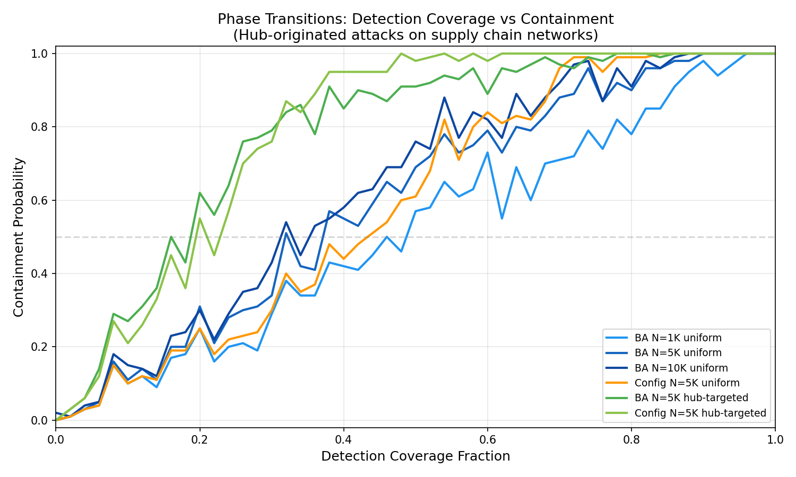
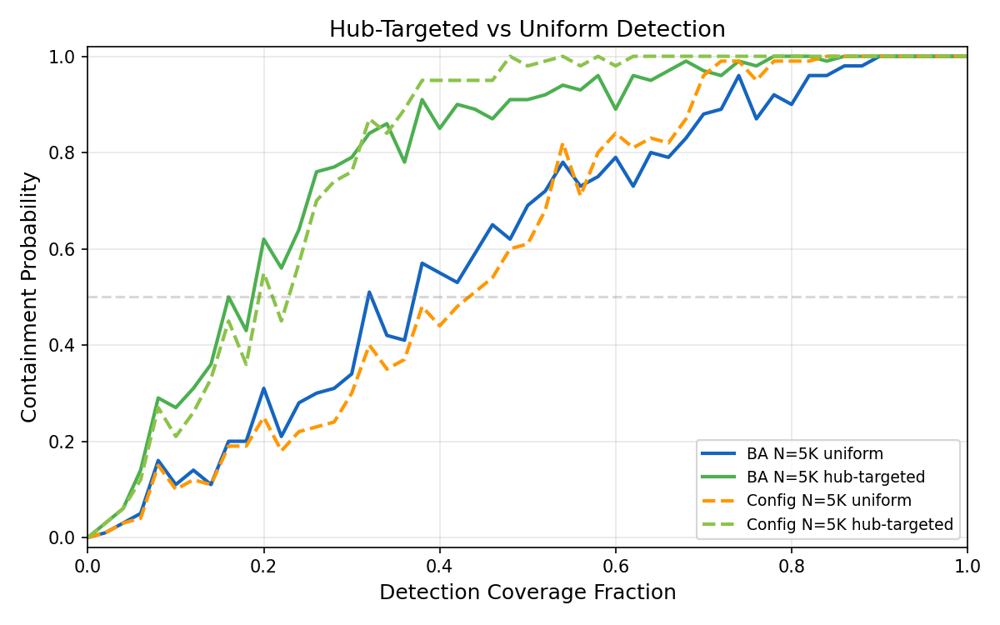
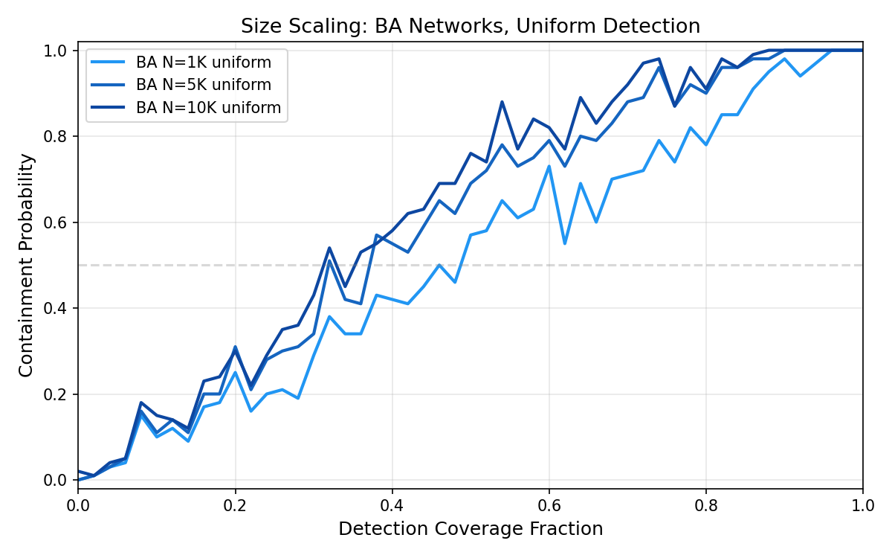
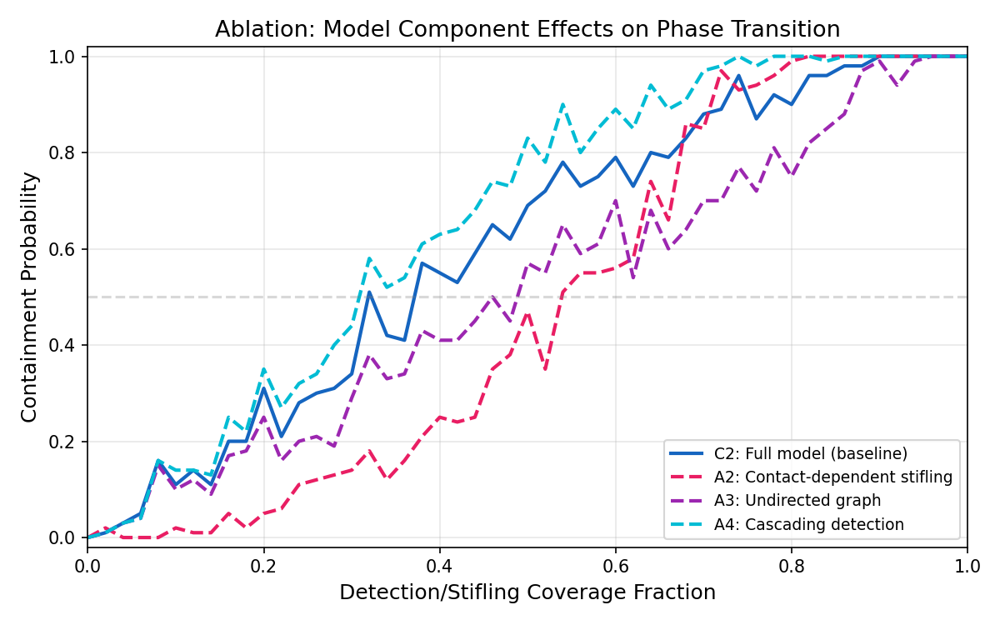

# Broadcast Contagion Phase Transitions in Software Supply Chain Networks

**Hub-targeted detection halves the critical coverage needed to contain supply chain contagion attacks: p_c = 0.19 vs 0.39 for uniform detection. But detection latency erodes half the theoretical advantage — the static percolation prediction overestimates the benefit by 2x.**

[](LICENSE)
[](https://www.python.org/downloads/)



## Key Results

| Finding | Metric | Evidence |
|---|---|---|
| Phase transition exists in all conditions | Containment probability: near-zero → near-one | 45,900 Monte Carlo runs |
| Uniform detection critical coverage | p_c = 0.39 [95% CI: 0.38, 0.40] | BA networks, N=5,000, hub-originated attacks |
| Hub-targeted detection critical coverage | p_c = 0.19 [95% CI: 0.18, 0.20] | Same conditions, 2.04x reduction |
| Detection latency erodes advantage | Hub-targeting factor: 2.04x (vs 3x static prediction) | Time-dependent detection vs contact-dependent stifling |
| ISS-to-supply-chain adaptation is non-cosmetic | \|Δp_c\| = 0.15 between mechanisms | Qualitatively different phase transition shapes |

All results are conditional on hub-originated attacks (top-1% packages by dependency count) on Barabási-Albert scale-free networks.

## The Finding

We adapted the ISS (Information Spreading and Stifling) model from social network epidemiology to software supply chain contagion. The key insight: supply chain attacks spread like broadcast contagion (one compromised package infects all dependents simultaneously), not like contact-dependent disease spread.

The practical implication: monitoring the top 1% most-depended-on packages (hub-targeted detection) is nearly as effective as monitoring 39% of all packages (uniform detection). But the theoretical 3x advantage predicted by static percolation (Cohen et al. 2003) shrinks to 2x when detection takes time — latency matters.

## Quick Start

```bash
git clone https://github.com/rexcoleman/cycle9-broadcast-contagion.git
cd cycle9-broadcast-contagion
pip install -r requirements.txt
bash reproduce.sh                    # full reproduction
```

## Methodology

- **Network model:** Barabási-Albert scale-free graphs (m=3, N=500-5,000)
- **Contagion model:** Broadcast (one-to-all) with heterogeneous time-dependent detection
- **Conditions:** 6 primary (2 detection strategies × 3 network sizes) + 3 ablation
- **Simulations:** 45,900 Monte Carlo runs total, 5 seeds per condition
- **Baselines:** Homogeneous SIS (Pastor-Satorras & Vespignani 2001), contact-dependent stifling

Full methodology in [EXPERIMENTAL_DESIGN.md](EXPERIMENTAL_DESIGN.md). All results in [FINDINGS.md](FINDINGS.md).

## Figures

| | |
|---|---|
|  |  |
| *Phase transition curves for all conditions* | *Hub-targeted vs uniform detection* |
|  |  |
| *Network size scaling effects* | *Ablation: detection mechanism comparison* |

## Related Work

- [ai-supply-chain-scanner](https://github.com/rexcoleman/ai-supply-chain-scanner) — Rule-based scanner for ML supply chain risks
- [controllability-bound](https://github.com/rexcoleman/controllability-bound) — Defense difficulty decomposition framework

## Citation

```bibtex
@software{coleman2026contagion,
  title = {Broadcast Contagion Phase Transitions in Software Supply Chain Networks},
  author = {Coleman, Rex},
  year = {2026},
  url = {https://github.com/rexcoleman/cycle9-broadcast-contagion},
  license = {MIT}
}
```

## License

MIT. See [LICENSE](LICENSE).
